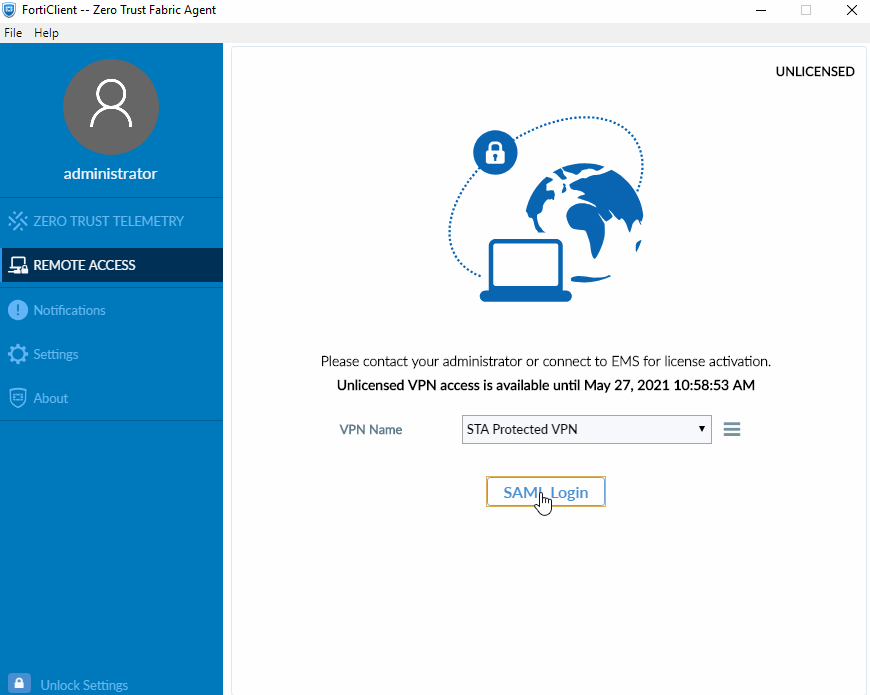
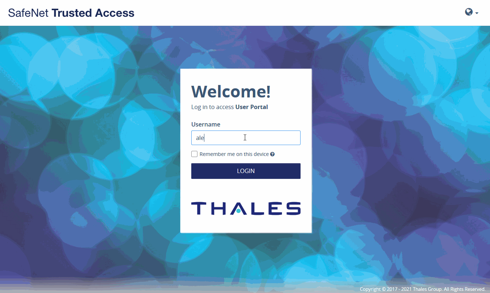

.. SafeNet Trusted Access documentation master file, created by
   sphinx-quickstart on Wed Mar 24 16:12:19 2021.
   You can adapt this file completely to your liking, but it should at least
   contain the root `toctree` directive.

========================================================================
FortiGate VPN and FortiClient with SafeNet Trusted Access using SAML 2.0
========================================================================

.. toctree::
   :maxdepth: 3
   :hidden:

   index

Overview
========

This guide shows how to implement adaptive authentication with strong contextual security policies to FortiGate SSL VPN and the FortiClient using SAML federation with SafeNet Trusted Access

Prerequisites
=============

  - FortiOS 6.4.4.1803 and above
  - FortiClient 6.4.2.1580 and above
  - A user with a SafeNet Trusted Access authenticator is enrolled
  - Users can authenticate using SafeNet Trusted Access

.. warning:: In evaluating this solution, it is advised to use a FortiGate firewall reserved exclusively for testing. Nevertheless, with limited resources, it's possible to create an SSL VPN portal on a dedicated port. Please review this document carefully, involve your FortiGate subject matter experts early in the cycle and as always proceed with caution.

Configuration Overview
======================

The configuration requires the following steps:

  **In SafeNet Trusted Access**

  - `Create FortiGate Application in SafeNet Trusted Access`_
  - `Configure STA Authentication Policy`_

  **In FortGate**

  - `Add a SAML Identity Provider to FortiGate`_
  - `FortiClient VPN Configuration`_

SafeNet Trusted Access Configuration
====================================

_`Create FortiGate Application in SafeNet Trusted Access`
*********************************************************

.. note:: Open SafeNet Trusted Access Console (you can use the following direct links based on your availability zone, opens in a new tab)

          |US Zone|

            .. |US Zone| raw:: html

              <a href="https://sta.us.safenetid.com" target="_blank">US Zone SafeNet Trusted Access Console</a>

          |EU Zone|

            .. |EU Zone| raw:: html

              <a href="https://sta.eu.safenetid.com" target="_blank">EU Zone SafeNet Trusted Access Console</a>

          |Classic Zone|

            .. |Classic Zone| raw:: html

              <a href="https://sta.safenetid.com" target="_blank">Classic Zone SafeNet Trusted Access Console</a>

In the STA Console, add FortiGate application by following these steps:

1. In **Applications** tab, click on the :guilabel:`+` button and search for **Generic Template**

.. thumbnail:: _images/applications.png

2. Name the application and choose **SAML** for the **Integration Protocol**

.. thumbnail:: _images/application.png

3. *Optional* - Change the Application Logo by clicking on the default icon. You can download FortiGate logo icon :download:`here <_downloads/fg_logo.png>`

.. thumbnail:: _images/add_icon.png

.. thumbnail:: _images/icon.png

  - Browse for or drag the logo icon downloaded above and click :guilabel:`Select`

4. Clcik :guilabel:`Add` to add the FortiGate Application

5. Switch to **Manual Configuration**

.. thumbnail:: _images/manual.png

.. _Cert:

- Download STA Tenant Certificate by clicking :guilabel:`Download X.509 certificate`

.. thumbnail:: _images/certificate.png

.. _SAML:

- Note both STA Tenant **Issuer/Entity ID** and STA **Single Sign-On Service** URL

.. thumbnail:: _images/entity.png

6. Click :guilabel:`Next Step`

7. Switch to **Manual Configuration**

.. thumbnail:: _images/manual2.png

8. Under **Account Details** provide the required details using the following values (replace **URL:PORT** with your own values depending on your FortGate SSL VPN configuration and port)

+--------------------------------+------------------------------------------+
| **Setting**                    | **Value**                                |
+--------------------------------+------------------------------------------+
| Entity ID                      | ::                                       |
|                                |                                          |
|                                |   https://URL:PORT/remote/saml/metadata/ |
+--------------------------------+------------------------------------------+
| Logout URL (Post Binding)      | ::                                       |
|                                |                                          |
|                                |   https://URL:PORT/remote/saml/logout/   |
+--------------------------------+------------------------------------------+
| Logout URL (Redirect Binding)  | ::                                       |
|                                |                                          |
|                                |   https://URL:PORT/remote/saml/logout/   |
+--------------------------------+------------------------------------------+
| Assertion Consumer Service URL | ::                                       |
|                                |                                          |
|                                |   https://URL:PORT/remote/saml/login     |
+--------------------------------+------------------------------------------+

.. thumbnail:: _images/account.png

9. Under **User Login ID Mapping**, select **SAS User ID**

.. thumbnail:: _images/nameid.png

10. Under **Return Attributes**, create an attribute by clicking :guilabel:`Add Atrribute` with *Return Attribute* **username** and *User Attribute* **SAS User ID**

.. thumbnail:: _images/attribute.png

11. Under **User Portal Settings**, change the *Federation Mode* to **SP Initiated** and enter the URL of your FortiGate SSL VPN portal and port number using the colon :code:`:` delimiter in *Service Login URL*

.. important:: For SSO to work correctly when using the STA User Portal (IDP Initiated SSO) the URL in *Service Login URL* has to be in the following format: **https://URL:PORT/remote/saml/start?realm=**

.. thumbnail:: _images/user_portal.png

12. Under **Advanced Settings**, change the **Name ID Format** to **Unspecified**

.. thumbnail:: _images/nameid_format.png

13. Under Advanced Settings, set the following settings:

-	**Skip request signature validation**
-	**Assertion not encrypted**
-	**Sign assertion and response**
-	**Enforce Post Binding**
-	**Back logout channel**

.. thumbnail:: _images/advanced.png

14. Click :guilabel:`Save Configuration`

15. Assign the FortiGate application to your target users by clicking on :guilabel:`Assign` and selecting **All Users** or **Users from any of these user groups:**

.. thumbnail:: _images/assign.png

16. Click :guilabel:`Save Configuration`

_`Configure STA Authentication Policy`
**************************************

In the STA Console, create a new Access Policy for FortiGate application by following these steps:

  #. Go to the :guilabel:`Policies` tab

  #. Click :guilabel:`+` to add a new Policy

  #. Name the new Policy, *for example FortiGate VPN*

  - **Polcy Scope**

    #. Under **Users**, click :guilabel:`All Users` to apply to all users or :guilabel:`Any of these User Groups:` to apply to specifc User Groups

    #. Under **Applications**, click :guilabel:`Any of these Applications`, click in the field and select **FortiGate** application

  - **Default Requirements**

    #. Select the desired authentication method *for example* :guilabel:`Password` and :guilabel:`Every access attempt` and :guilabel:`Token Based Authentication (OTP)` and :guilabel:`Every access attempt`

  4. Click :guilabel:`Save` to save the new Policy

.. thumbnail:: _images/policy.png

The SafeNet Trusted Access configuration of the FortiGate application is complete

FortiGate Configuration
=======================

Complete these steps on your FortiGate firewall in order to set **SafeNet Trusted Access** as the Identity Provider

_`Add a SAML Identity Provider to FortiGate`
********************************************

1. Upload your STA Tenant Certificate obtained from past step 5 as a remote certificate:

- :menuselection:`System --> Certificates --> Import`

.. note:: In the "Import" menu, slect **Remote Certificate**. Click :guilabel:`Upload` and select the STA Tenant certificate downloaded :ref:`here <Cert>`

.. thumbnail:: _images/fg_cert.png

.. important:: After import, note the **Name** of the imported remote certificate. This value will be required in the next step. *Example:* **REMOTE_Cert_1**

.. note:: Next steps are **CLI Only**, connect to your firewall using **SSH**

2. Create the SafeNet SAML IdP with the values noted in :ref:`this <SAML>` step (replace **URL:PORT** with your own values depending on your FortGate SSL VPN configuration and port)

.. code-block::

   config user saml

.. code-block::

   edit "safenet-sslvpn"

.. code-block::

   set entity-id "https://URL:PORT/remote/saml/metadata/"

.. code-block::

   set single-sign-on-url "https://URL:PORT/remote/saml/login/"

.. code-block::

   set single-logout-url "https://URL:PORT/remote/saml/logout/"

.. code-block::

   set idp-entity-id "<STA Tenant Issuer/Entity ID>"

.. code-block::

   set idp-single-sign-on-url "<STA Single Sign-On Service>"

.. code-block::

   set idp-single-logout-url "<STA Single Sign-On Service>"

.. code-block::

   set idp-cert "REMOTE_Cert_1"

.. code-block::

   set user-name "username"

.. code-block::

   next

.. code-block::

   end

.. note:: The following steps can be completed in the FortiGate management console (in this guide we use CLI). These settings will require adjustments. Consult with your FortiGate team as required

3. Create a **user group** and set the member with the above saml user (*"safenet-sslvpn"*)

.. code-block::

   config user group

.. code-block::

   edit "saml_safenet"

.. code-block::

   set member "safenet-sslvpn"

.. code-block::

   next

.. code-block::

   end

4. Complete the **SSL VPN** configuration to match your current environment

- **SSL-VPN Settings**

.. code-block::

  config vpn ssl settings
   set servercert "Fortinet_Factory"
   set tunnel-ip-pools "SSLVPN_TUNNEL_ADDR1"
   set tunnel-ipv6-pools "SSLVPN_TUNNEL_IPv6_ADDR1"
   set port 10443
   set source-interface "inside"
   set source-address "all"
   set source-address6 "all"
   set default-portal "full-access"
   config authentication-rule
       edit 1
           set groups "saml_safenet"
           set portal "full-access"
       next
   end
  end

- **Firewall Policy**

.. code-block::

  config firewall policy
   edit 101
       set name "SAML_SSLVPN"
       set srcintf "ssl.root"
       set dstintf "inside"
       set srcaddr "all"
       set dstaddr "corpnet"
       set action accept
       set schedule "always"
       set service "ALL"
       set groups "saml_safenet"
       set nat enable
   next
  end

- **Increase Login Timeout**

.. code-block::

  config system global
   set remoteauthtimeout 120
  end

_`FortiClient VPN Configuration`
********************************

1. Launch the **FortiClient** (version 6.4.2 or above) on the client machine

2. Add a new connection

- Enter a **Connection Name** and **Description**

- Enter your **SSL VPN URL** in **Remote Gateway**

- *If required* - Select **Customize Port** and enter your custom port

- Select **Enable Single Sign On (SSO) for VPN Tunnel**

.. thumbnail:: _images/fg_client.png

3. Click :guilabel:`Save`

The FortiClient configuration is complete

Test the solution
=================

Using FortiClient
*****************

1. Launch the **FortiClient** on the client machine

2. In the **Remote Access** pane, select the VPN connection created in the previous step

3. Click on :guilabel:`SAML Login` to initiate the connection

Using SafeNet Trusted Access User Portal
****************************************

1. Navigate and login to the **SafeNet Trusted Access User Portal**

2. Click on the **FortiGate** Application

3. You are redirected and logged in to the FortiGate SSL VPN Web Portal

